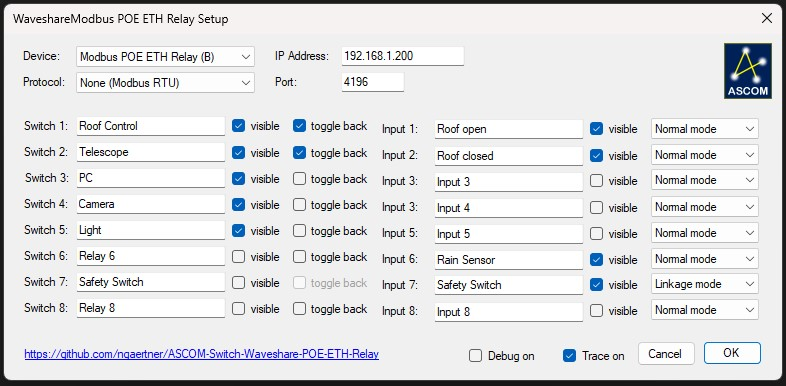
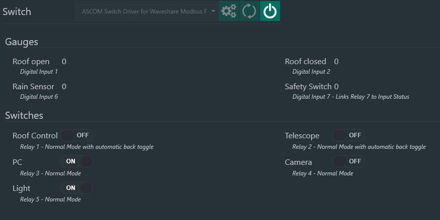

# ASCOM Driver for Waveshare Ethernet Relays

## Disclaimer

Please note that I am not affiliated , associated, authorized, endorsed by, or in *any* way officially connected to Waveshare International Limited.

THE SOFTWARE IS PROVIDED "AS IS", WITHOUT WARRANTY OF ANY KIND, EXPRESS OR
IMPLIED, INCLUDING BUT NOT LIMITED TO THE WARRANTIES OF MERCHANTABILITY,
FITNESS FOR A PARTICULAR PURPOSE AND NONINFRINGEMENT. IN NO EVENT SHALL THE
AUTHORS OR COPYRIGHT HOLDERS BE LIABLE FOR ANY CLAIM, DAMAGES OR OTHER
LIABILITY, WHETHER IN AN ACTION OF CONTRACT, TORT OR OTHERWISE, ARISING FROM,
OUT OF OR IN CONNECTION WITH THE SOFTWARE OR THE USE OR OTHER DEALINGS IN
THE SOFTWARE.

## Overview and Purpose

This software is a "Switch" device driver for the ASCOM platform that allows to connect to the following ethernet relay devices:

**Modbus POE ETH Relay [[link](https://www.waveshare.com/modbus-poe-eth-relay.htm)]**
8-ch Ethernet Relay Module, Modbus RTU/Modbus TCP Protocol, PoE port Communication, With Various Isolation And Protection Circuits

**Modbus POE ETH Relay (B) [[link](https://www.waveshare.com/modbus-poe-eth-relay-b.htm.htm)]**
8-ch Ethernet Relay Module (B) With Digital Input, Modbus RTU/Modbus TCP Protocol, PoE Port Communication, With Various Isolation And Protection Circuits

The driver implements all features offered by the device firmware, which include switching and flashing relays and (for the "B" device) reading and automatic processing of digital inputs using linkage options between digital inputs and associated relays.

The Waveshare ethernet relays are cheap (compared to dedicated astronomical hardware), run stable and and are very versatile.
The devices are powered by Power over Ethernet (PoE IEEE 802.3af), a standard DC Power port or via screw terminal (7~36V DC) and the switches and inputs are adressed using TCP based communication via the LAN port.
According to Waveshare the devices are rated for an operation temperature of -15℃ - 70℃, which qualifies them for typical outdoor/observatory use (given that they are installed properly and protected in a sealed switch box).
Note that for these devices a LAN network is mandatory - it is not possible to connect the relays directly to an observatory PC.
Typical use-cases are to control devices and digital inputs within a (remote) observatory via LAN (independent from PCs), and automate the control of devices during astrophotographic sequences from popular softwares like N.I.N.A.

**Note:** I highly recommend to use the new "B" revision model, to make full use of the digital input functionality.

### Software Features at a Glance

* Full control of naming and visibility of the hardware relays and inputs in the ASCOM driver
* Toggle setting to automatically flash a relay on/off (e.g. for triggering actions like the control a roll-off roof)
* Reading of digital sensors (e.g. rain sensors, safety circuits or limit switches)
* Different linkage types between digital inputs and relays (e.g. for safety circuits or to react on environmental conditions)

## Screenshots

